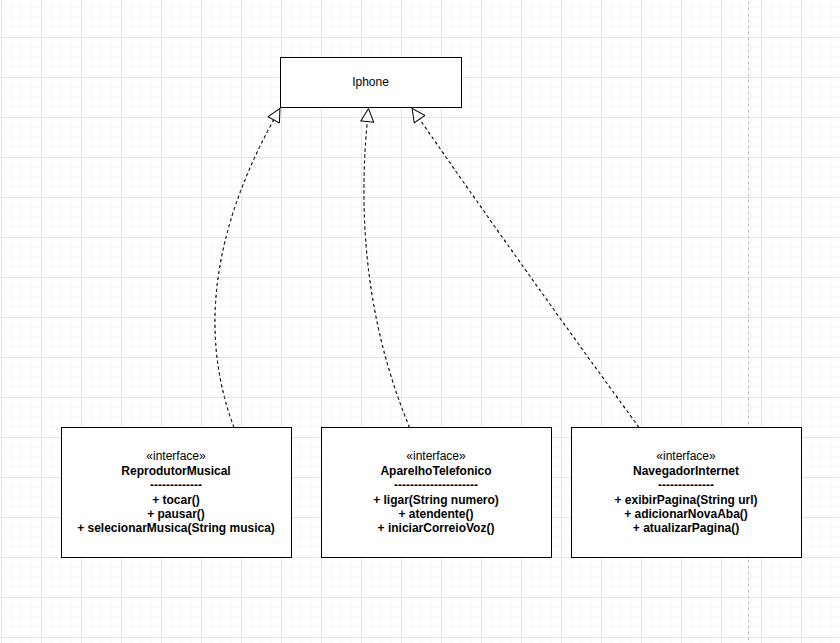

# 📱 Desafio POO - Modelando o iPhone

Este projeto foi desenvolvido como parte de um **desafio de Programação Orientada a Objetos (POO)** da plataforma **DIO (Digital Innovation One)** no curso de **Java**.

O objetivo é modelar o comportamento do **iPhone** utilizando **interfaces e implementação em Java**, com base no vídeo de lançamento do primeiro iPhone apresentado por **Steve Jobs**.

Nesse vídeo é apresentado que o iPhone é a combinação de três dispositivos:

- 🎵 **iPod (Reprodutor Musical)**
- 📞 **Telefone**
- 🌐 **Internet Communicator (Navegador)**

---

# 🧠 Conceitos de POO Aplicados

Este projeto utiliza diversos conceitos fundamentais da **Programação Orientada a Objetos**:

- Interfaces
- Implementação de múltiplas interfaces
- Sobrescrita de métodos (`@Override`)
- Instanciação de objetos
- Separação de responsabilidades

Cada funcionalidade do iPhone foi representada por **uma interface**, enquanto a classe `Iphone` implementa todas elas.

---

# 🧩 Estrutura do Projeto

```
src
 ├ ReprodutorMusical.java
 ├ AparelhoTelefonico.java
 ├ NavegadorInternet.java
 ├ Iphone.java
 └ AparelhoCelular.java
 uml
 └ diagrama-uml.png
```

### 📄 Interfaces

As interfaces representam os **comportamentos do dispositivo**.

#### 🎵 ReprodutorMusical

Métodos:

- `tocar()`
- `pausar()`
- `selecionarMusica(String musica)`

---

#### 📞 AparelhoTelefonico

Métodos:

- `ligar(String numero)`
- `atender()`
- `iniciarCorreioVoz()`

---

#### 🌐 NavegadorInternet

Métodos:

- `exibirPagina(String url)`
- `adicionarNovaAba()`
- `atualizarPagina()`

---

# 📱 Classe Iphone

A classe `Iphone` implementa todas as interfaces e reúne as funcionalidades do dispositivo.

```java
public class Iphone implements ReprodutorMusical, AparelhoTelefonico, NavegadorInternet {
}
```

Ela fornece a **implementação concreta dos métodos definidos nas interfaces**.

---

# 🚀 Classe Principal (Main)

A classe `AparelhoCelular` contém o método `main`, responsável por criar um objeto `Iphone` e executar suas funcionalidades.

Exemplo:

```java
public class AparelhoCelular {

    public static void main(String[] args) {

        Iphone iphone = new Iphone();

        iphone.tocar();
        iphone.pausar();
        iphone.selecionarMusica("Numb");

        iphone.ligar("11999999999");
        iphone.atender();
        iphone.iniciarCorreioVoz();

        iphone.exibirPagina("google.com");
        iphone.adicionarNovaAba();
        iphone.atualizarPagina();
    }
}
```

---

# 📊 Representação UML (Conceito)

```
          ReprodutorMusical
                ▲
                │
          AparelhoTelefonico
                ▲
                │
          NavegadorInternet
                ▲
                │
               Iphone
```
## 📊 Diagrama UML



A classe **Iphone implementa todas as interfaces**, reunindo os comportamentos do dispositivo.

---

# 🛠 Tecnologias Utilizadas

- ☕ **Java**
- 🧠 **Programação Orientada a Objetos**
- 📊 **Modelagem UML**

---

# 🎯 Objetivo do Projeto

Demonstrar na prática como **interfaces podem definir comportamentos** e como uma classe pode **implementar múltiplas funcionalidades**, aplicando conceitos fundamentais de **POO em Java**.

---

⭐ Projeto desenvolvido para fins educacionais no **Bootcamp Java da DIO**.